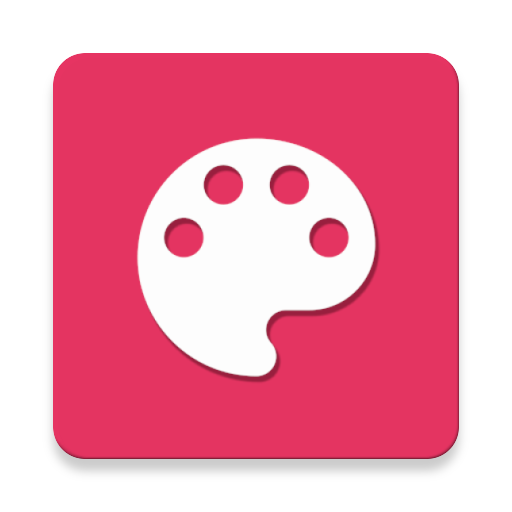
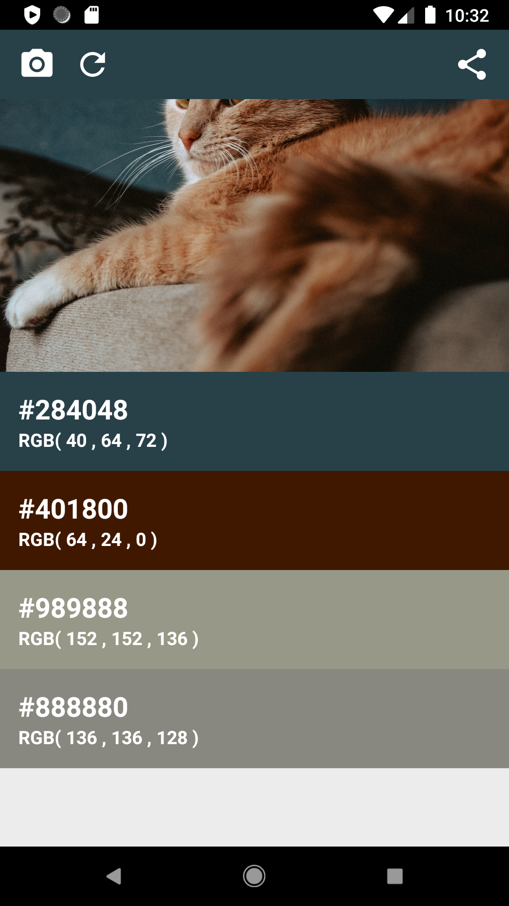
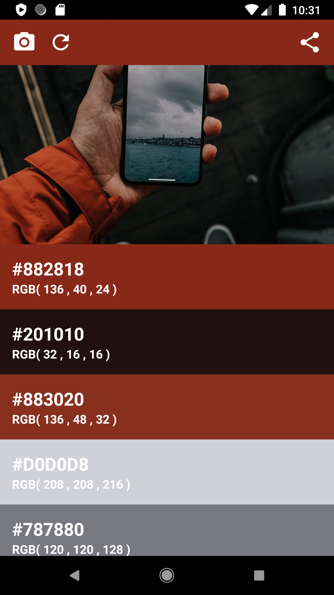
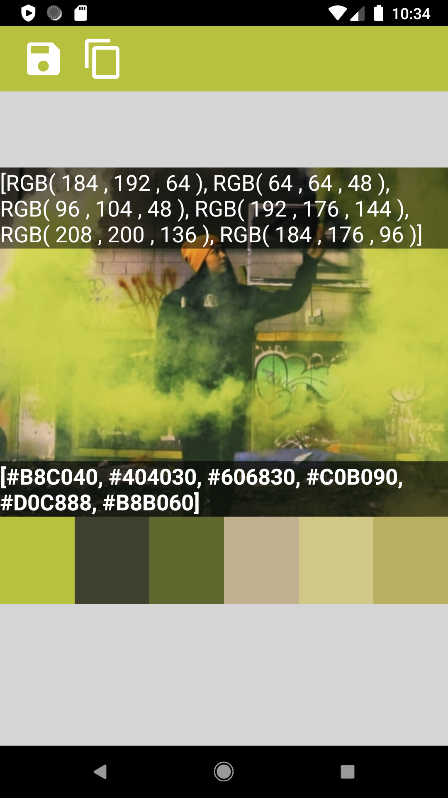
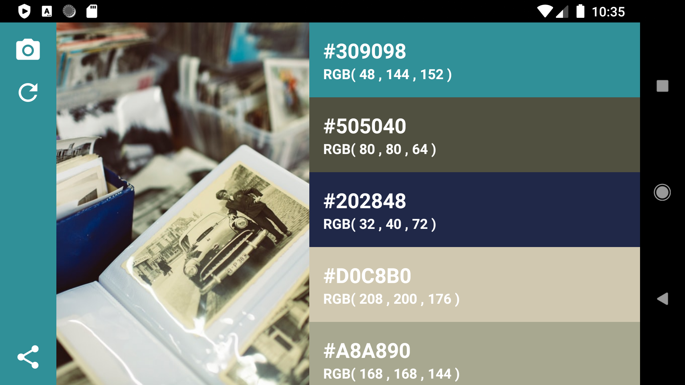
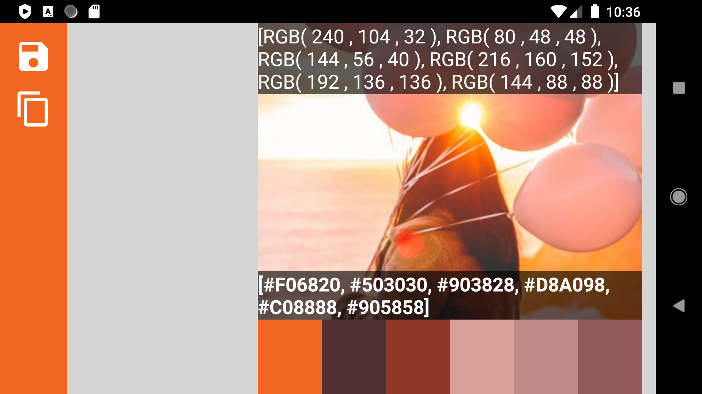

<h2 align="center"><b>ColorPicker</h2>
<h4 align="center">Get beautiful Color ideas easily!</h4>

# Get Beautiful color ideas easliy
When open the app, get Unsplash photos as default. You can get any photos in gallery and get represent colors.

 
 
 

## Support Landscape mode

 

# Easily export Colors as PNG file.

As you can see, this app can export colors as png.
This feature is very useful when you want share color ideas with others.

